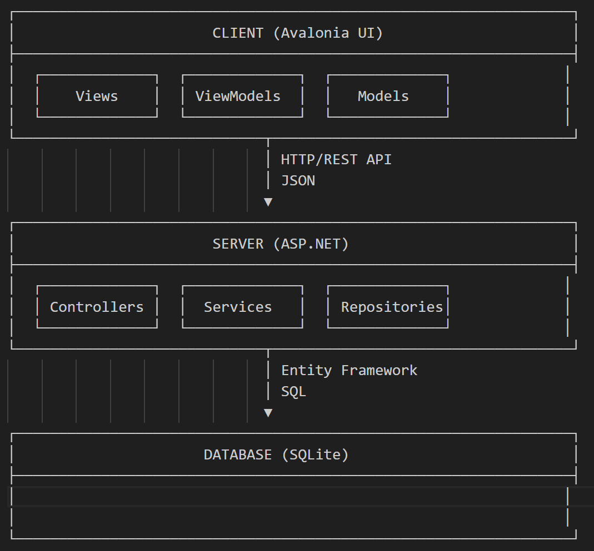

# Инструкция по установке и использованию Terraform LogViewer

## 📜 Содержание
- [Инструкция по установке](#-инструкция-по-установке)
- [API Endpoints](#-api-endpoints)
- [Использование приложения](#-Использование-приложения)
- [Архитектура приложения](#-Архитектура-Приложения)
- [Диаграмма архитектуры приложения](#-диаграмма-архитектуры-приложения)
- [Задачи](#Задачи)

## 🪛 Инструкция по установке
1. Необходимо скачать Microsoft Visual Studio
2. Скачать SQLite
3. Скачать exe приложения из релиза 
4. Установить .NET 8.0
5. Подтянуть все необходимые пакеты, если они не подтянулись автоматически
6. Для базы данных необходимо ввести 3 команды, эти команды необходимо выполнять внутри командной строки внутри папки server
    - dotnet add package Microsoft.EntityFrameworkCore.Design
    - dotnet ef migrations add Initial
    - dotnet ef database update

## 🔌 API Endpoints
- **адрес сервера:** **`http://localhost:7084`**
⏺ **`Post /api/log/logs`**
⏺ **`Get /api/log/logs`**
⏺ **`Get /api/log/getfilename/{sessionName}`**
⏺ **`Post /api/session/connect/{sessionName}`**
⏺ **`Delete /api/session/delete/{sessionName}`**

## 🚀 Использование приложения
### ⚙️ Функционал и расширения
- Приложение позволяет загружать json файлы с логами
- Обрабатывать и приводить в удобный читаемый вид файлы логов
- Парсить логи
- Выдача диаграммы Ганта по файлам логов
- Сохранять логи в базу данных
- Создавать сессии для загрузки файлов и удалять их при закрытии сессии
- Поддержка расширений, в том числе и gRPC

### 🔎 Фильтрация и поиск
- Фильтрация логов по уровням info, debug, trace, warn, error, level missed
- Полнотекстовый поиск ключевых слов 
- Фильтрация секций plan и apply
- Распознавание timestamp

### 📈 Графическое представление
- Подсветка логов в зависимости от их уровня info, debug, trace, warn, error, level missed
- Показ диаграммы Ганта для отображения хронологии запросов

### 🔄 Загрузка и обработка логов
1. Перейдите в раздел "Сессии" и создайте новую сессию.
2. Загрузите JSON-файл логов через интерфейс.
3. Примените фильтры по уровню логов или секциям.
4. Нажмите "Показать диаграмму Ганта" для визуализации.

## 📊 Архитектура Приложения
- Язык программирования - C#
- Фреймворки - ASP.NET, Avalonia UI
- Архитектура клиентской стороны - MVVM
- Архитектура серверной стороны - Clean
- База данных - SQLite через Entity Framework

## 📁 Диаграмма архитектуры приложения

## 📅 Задачи
Задачи распределялись по 2-м основным направлениям - это Backend и Frontend, а также задачи распределялись с указанием уровня приоритета и именно в такой последовательности они выполнялись

Все задачи можно посмотреть на [kanban-доске](https://github.com/users/Vlad-Vershinin/projects/5/views/1)